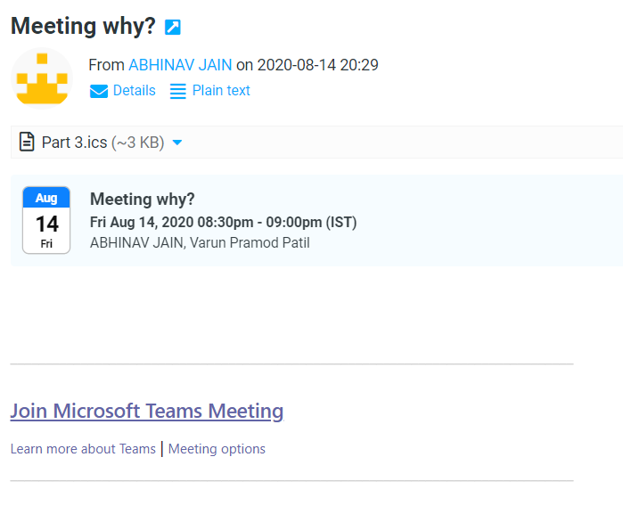

# Roundcube Banner ICS

Displays information about events from ICS attachmetns

## Installation
To install, get the plugin with composer in your roundcube directory
```
composer require radialapps/banner-ics
```

## Screenshot
The plugin adds a calendar icon along with the information of the event
<br/>


## License
Permissively licensed under the MIT license

